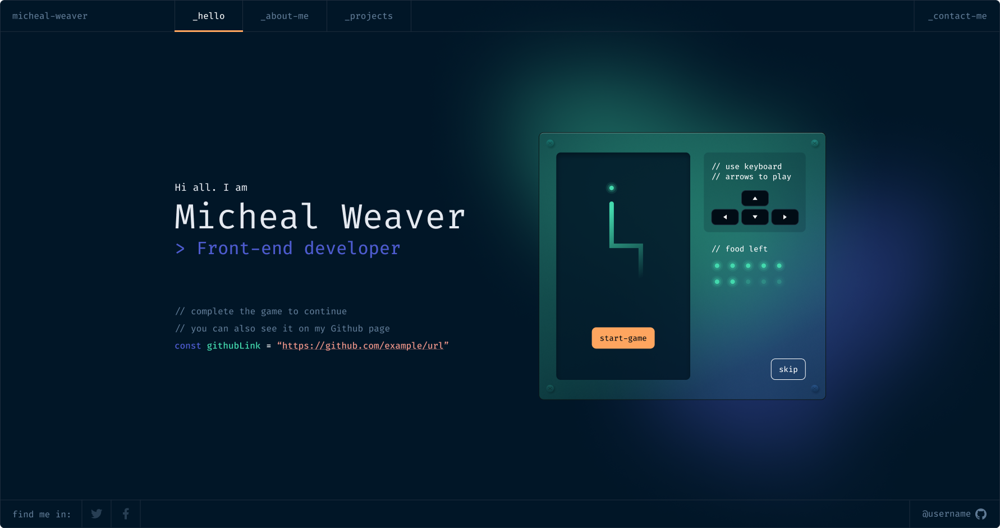

  

<h1 align="center">
  developer-portfolio
</h1>

  The first open source version of <a href="https://www.figma.com/community/file/1100794861710979147"> Portfolio for Developers Concept V.2</a>, designed by <a>@darelova</a> and developed by <a href="https://github.com/alexruedadev">@alexruedadev</a>. Built with <a href="https://www.gatsbyjs.org/" target="_blank">Nuxt.js 3.0</a> and hosted with <a href="https://www.netlify.com/" target="_blank">Netlify</a>.

  

## 🚨 Forking this repo

## 🛠 Installation & Configuration

## 🚀 Building and Running for Production

## 🎨 Design Reference